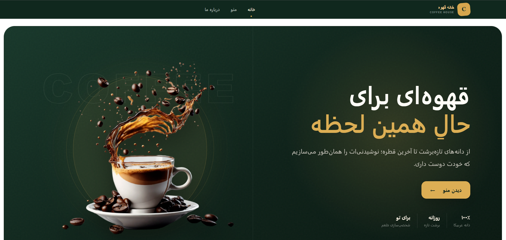
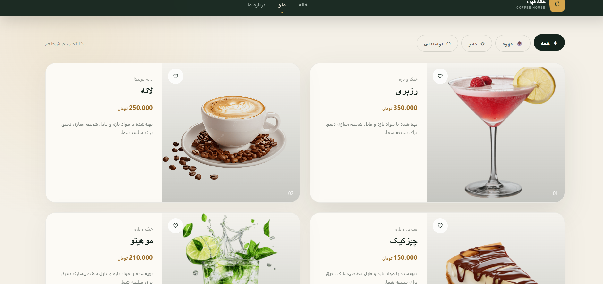
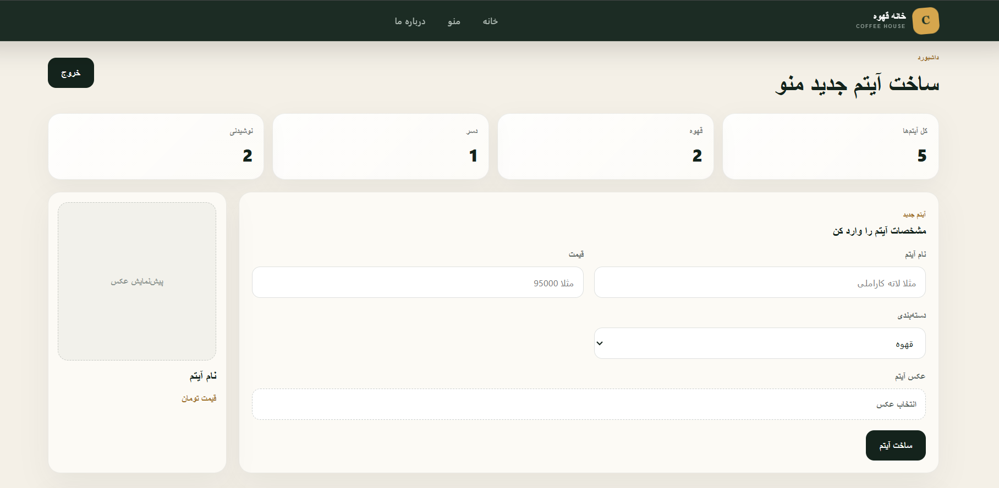

# Coffee House Menu

یک وب‌اپلیکیشن شیک برای نمایش منوی کافه، مدیریت آیتم‌ها و ساخت تجربه‌ای تمیز و فارسی برای مشتری و ادمین.



## ویژگی‌ها

- صفحه اصلی با طراحی RTL، هویت بصری کافه و CTA برای رفتن به منو
- منوی دسته‌بندی‌شده برای قهوه، دسر و نوشیدنی‌ها
- کارت‌های محصول با تصویر، قیمت، توضیحات و امکان علاقه‌مندی
- پنل ادمین برای ساخت آیتم جدید منو همراه با پیش‌نمایش تصویر
- احراز هویت ادمین و مدیریت نشست‌ها در بک‌اند
- API مبتنی بر ASP.NET Core برای دریافت، ساخت و مدیریت آیتم‌های منو
- ذخیره و سرو فایل‌های آپلود شده از مسیر `wwwroot/uploads`

## پیش‌نمایش

### صفحه منو



### داشبورد ادمین



## تکنولوژی‌ها

- React 19
- Vite
- React Router
- Axios
- Bootstrap / React Bootstrap
- SweetAlert2
- ASP.NET Core Web API
- Entity Framework Core
- SQL Server

## ساختار پروژه

```text
.
|-- src/                              # Frontend React app
|   |-- components/                   # Navbar, Footer, Hero
|   |-- layout/                       # Shared page layout
|   `-- pages/                        # Home, Menu, About, Admin
|-- back-end/CaffeeMenuWebAPI/        # ASP.NET Core backend
|   `-- CaffeeMenuWebAPI/
|       |-- Controllers/
|       |-- Data/
|       |-- Models/
|       |-- Services/
|       `-- wwwroot/uploads/
`-- docs/screenshots/                 # README screenshots
```

## راه‌اندازی فرانت‌اند

```bash
npm install
npm run dev
```

بعد از اجرا، فرانت‌اند معمولا روی آدرس زیر در دسترس است:

```text
http://localhost:5173
```

## راه‌اندازی بک‌اند

ابتدا connection string دیتابیس را در فایل زیر تنظیم کنید:

```text
back-end/CaffeeMenuWebAPI/CaffeeMenuWebAPI/appsettings.json
```

سپس بک‌اند را اجرا کنید:

```bash
cd back-end/CaffeeMenuWebAPI/CaffeeMenuWebAPI
dotnet run
```

در حالت Development، Swagger برای تست API فعال می‌شود.

## اسکریپت‌های کاربردی

```bash
npm run dev      # اجرای محیط توسعه
npm run build    # ساخت نسخه production
npm run preview  # پیش‌نمایش build
npm run lint     # بررسی lint
```

## مسیرهای اصلی

- `/` صفحه اصلی
- `/menu` منوی کافه
- `/about` درباره ما
- `/admin/login` ورود ادمین
- `/admin` داشبورد ادمین

## درباره پروژه

Coffee House Menu برای کافه‌هایی ساخته شده که می‌خواهند منوی آنلاین ساده، زیبا و قابل مدیریت داشته باشند. تمرکز پروژه روی ظاهر تمیز، تجربه کاربری فارسی، و یک پنل ادمین کاربردی است تا اضافه کردن آیتم‌های جدید سریع و بی‌دردسر انجام شود.
